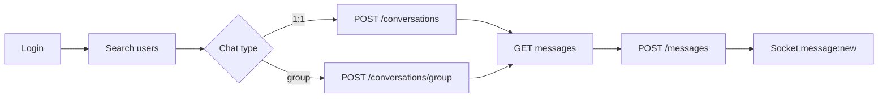
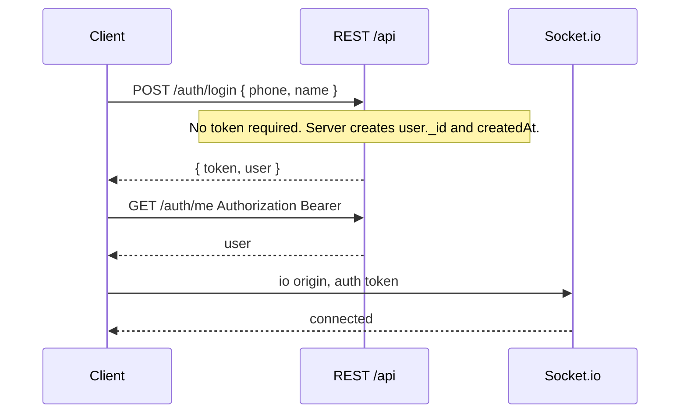
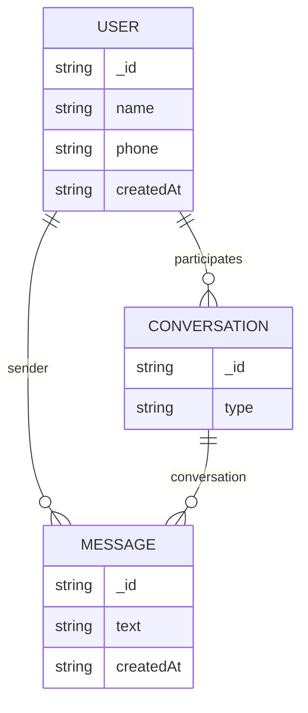

# Chat API Reference

Real-time 1:1 and group messaging.

Response bodies and status codes in this document come from the live service. The official Swagger UI does not document them: [https://frontend-task-chatapp.onrender.com/docs/](https://frontend-task-chatapp.onrender.com/docs/)

---

## Base URL

```
https://frontend-task-chatapp.onrender.com/api
```

Socket.io (not under `/api`):

```
https://frontend-task-chatapp.onrender.com
```

All request and response bodies are JSON (`Content-Type: application/json`).

---

## Quick start

```bash
# 1. Login (new phone numbers are registered automatically)
curl -s -X POST https://frontend-task-chatapp.onrender.com/api/auth/login \
  -H "Content-Type: application/json" \
  -d '{"phone":"+15551234567","name":"Ada Lovelace"}'
# → { "token": "<jwt>", "user": { ... } }

# 2. Search people
curl -s "https://frontend-task-chatapp.onrender.com/api/users/search?q=Ada" \
  -H "Authorization: Bearer <jwt>"

# 3. Start a 1:1 chat
curl -s -X POST https://frontend-task-chatapp.onrender.com/api/conversations \
  -H "Authorization: Bearer <jwt>" \
  -H "Content-Type: application/json" \
  -d '{"userId":"<otherUserId>"}'

# 4. Send a message
curl -s -X POST https://frontend-task-chatapp.onrender.com/api/messages \
  -H "Authorization: Bearer <jwt>" \
  -H "Content-Type: application/json" \
  -d '{"conversationId":"<conversationId>","text":"Hello!"}'
```

Typical UI flow: **login → search → open 1:1 or create group → load messages → send → listen on the socket for new messages**.



---

## Authentication

1. Call `POST /auth/login` with `phone` and `name`. There is no signup endpoint.
2. Store `token`.
3. Send it on every other REST call:

```http
Authorization: Bearer <token>
```

4. Pass the same token when opening Socket.io (`auth: { token }`).



| Situation | Status | `error.code` |
|---|---|---|
| Header missing | `400` | `NO_TOKEN` |
| Token invalid | `401` | `INVALID_TOKEN` |

---

## Errors

Every error body looks like this:

```json
{
  "error": {
    "message": "Validation failed",
    "code": "VALIDATION_ERROR",
    "details": [{ "path": "phone", "message": "Required" }]
  }
}
```

`details` is only present for validation errors.

| `code` | HTTP | Meaning |
|---|---|---|
| `VALIDATION_ERROR` | `400` | Missing or invalid field |
| `NO_TOKEN` | `400` | No `Authorization` header |
| `UNKNOWN_USER` | `400` | `userId` does not exist |
| `INVALID_TOKEN` | `401` | Bad JWT |
| `FORBIDDEN` | `403` | Not a member, or not a group admin |
| `NOT_FOUND` | `404` | Conversation does not exist |

---

## Common objects

How records relate on the live API:



- Direct conversation: `type: "direct"`, other user in `participant`
- Group: `type: "group"`, `name`, `admins[]`, `participants[]` (at least 3 members)

**User** (response object — `_id` and `createdAt` are created in the database, not sent by the client)

```json
{
  "_id": "6a883cd1e5d6aac9752208e0",
  "name": "Ada Lovelace",
  "phone": "+15551234567",
  "createdAt": "2026-08-21T11:56:01.385Z"
}
```

Search results and nested group members omit `createdAt`.

**Message (REST)**

```json
{
  "_id": "6a883cf4e5d6aac9752209de",
  "conversation": "6a883cd9e5d6aac9752208ff",
  "sender": "6a883cd1e5d6aac9752208e0",
  "text": "Hello!",
  "createdAt": "2026-08-21T11:56:36.584Z"
}
```

`sender` is a user id. `createdAt` is ISO-8601.

**Message (socket `message:new`)** — same data, different field names:

| REST | Socket |
|---|---|
| `_id` | `id` |
| `createdAt` as `"2026-08-21T11:56:36.584Z"` | `createdAt` as `1787314821893` (milliseconds) |

Normalize these in the client before rendering.

---

## Endpoints

### Auth

#### Login or register

```
POST /auth/login
```

**Public — no token.** Send only `phone` and `name`. If the phone is new, an account is created. If it already exists, that account is returned.

**Request body** — you send:

| Field | Type | Required | Notes |
|---|---|---|---|
| `phone` | string | yes | |
| `name` | string | yes | |

Do **not** send `_id`, `createdAt`, or `token`. The database assigns `_id` and `createdAt`; the server returns `token`.

```json
{ "phone": "+15551234567", "name": "Ada Lovelace" }
```

**`200 OK`** — server returns:

| Field | Set by |
|---|---|
| `token` | Server (JWT for later requests) |
| `user._id` | Database |
| `user.name` | Echo of request |
| `user.phone` | Echo of request |
| `user.createdAt` | Database |

```json
{
  "token": "<jwt>",
  "user": {
    "_id": "6a883cd1e5d6aac9752208e0",
    "name": "Ada Lovelace",
    "phone": "+15551234567",
    "createdAt": "2026-08-21T11:56:01.385Z"
  }
}
```

Logging in again with the same phone returns `200`, the same `user._id`, and a new `token`.

**Errors**

| Body | Status | `code` |
|---|---|---|
| Missing `phone` | `400` | `VALIDATION_ERROR` |
| Missing `name` | `400` | `VALIDATION_ERROR` |

---

#### Get current user

```
GET /auth/me
```

Requires auth. Use this to restore a session.

**`200 OK`**

```json
{
  "_id": "6a883cd1e5d6aac9752208e0",
  "name": "Ada Lovelace",
  "phone": "+15551234567",
  "createdAt": "2026-08-21T11:56:01.385Z"
}
```

**Errors:** `400 NO_TOKEN` · `401 INVALID_TOKEN`

---

### Users

#### Search users

```
GET /users/search?q={query}
```

Requires auth. Search by name or phone.

**Query**

| Name | Type | Required |
|---|---|---|
| `q` | string | yes (send a real query from the UI) |

**`200 OK`** — a JSON array (not `{ data: ... }`):

```json
[
  {
    "_id": "6a883cd3e5d6aac9752208e4",
    "name": "Grace Hopper",
    "phone": "+15554313361"
  }
]
```

No matches → `[]`.

> **Implement this in the UI:** do not call search with an empty `q`. `?q=` and omitting `q` both return `200` with a list of 50 users.

---

### Conversations

#### List conversations

```
GET /conversations
```

Requires auth. Direct chats and groups the current user belongs to.

**`200 OK`**

```json
{
  "data": [
    {
      "_id": "6a883cd9e5d6aac9752208ff",
      "type": "direct",
      "updatedAt": "2026-08-21T11:56:39.234Z",
      "lastMessage": {
        "text": "Hello!",
        "sender": "6a883cd1e5d6aac9752208e0",
        "createdAt": "2026-08-21T11:56:38.999Z"
      },
      "participant": {
        "_id": "6a883cd3e5d6aac9752208e4",
        "name": "Grace Hopper",
        "phone": "+15554313361"
      }
    },
    {
      "_id": "6a883ce8e5d6aac975220986",
      "type": "group",
      "name": "Project Team",
      "createdBy": "6a883cd1e5d6aac9752208e0",
      "admins": ["6a883cd1e5d6aac9752208e0"],
      "updatedAt": "2026-08-21T11:56:35.136Z",
      "lastMessage": {},
      "participants": [
        { "_id": "...", "name": "...", "phone": "..." }
      ]
    }
  ]
}
```

Use `type` to branch the UI:

| `type` | Other people | Title |
|---|---|---|
| `direct` | `participant` (one user) | `participant.name` |
| `group` | `participants` (array) | `name` |

`lastMessage` is `{ text, sender, createdAt }` when there is a message, or `{}` when there is not.

---

#### Start a 1:1 conversation

```
POST /conversations
```

Requires auth. Opens an existing 1:1 if one already exists.

**Body**

| Field | Type | Required |
|---|---|---|
| `userId` | string | yes — the other user’s `_id` from search |

```json
{ "userId": "6a883cd3e5d6aac9752208e4" }
```

**`200 OK`**

```json
{
  "_id": "6a883cd9e5d6aac9752208ff",
  "participants": [
    "6a883cd1e5d6aac9752208e0",
    "6a883cd3e5d6aac9752208e4"
  ],
  "createdAt": "2026-08-21T11:56:09.915Z"
}
```

This response is thinner than the list item: `participants` are id strings, and there is no `type` or `participant` object. After creating, either use `_id` to load messages or refresh `GET /conversations` for the full list shape.

**Errors**

| Condition | Status | `code` |
|---|---|---|
| User does not exist | `400` | `UNKNOWN_USER` |

> Do not pass the current user’s own id as `userId`.

---

#### Get messages

```
GET /conversations/{id}/messages
```

Requires auth. Caller must be a participant.

**Path**

| Name | Type |
|---|---|
| `id` | conversation id |

**Query**

| Name | Type | Required | Description |
|---|---|---|---|
| `limit` | integer | no | Page size (e.g. `20`) |
| `before` | string | no | Message `_id` for older pages |

**`200 OK`** — newest messages first:

```json
{
  "messages": [
    {
      "_id": "6a883ce2e5d6aac97522094f",
      "conversation": "6a883cd9e5d6aac9752208ff",
      "sender": "6a883cd1e5d6aac9752208e0",
      "text": "Hello!",
      "createdAt": "2026-08-21T11:56:18.736Z"
    }
  ],
  "hasMore": false
}
```

When `limit` is smaller than the thread, `hasMore` is `true`. Reverse the array in the UI if you render oldest → newest.

**Errors**

| Condition | Status | `code` | `message` |
|---|---|---|---|
| Not a member | `403` | `FORBIDDEN` | `Not a participant of this conversation` |
| Bad id | `404` | `NOT_FOUND` | `Conversation not found` |

---

### Groups

A group needs **at least 3 members** (you plus two others). The creator is an admin.

Only admins can add members, remove others, promote admins, or rename. Any member can leave.

#### Create a group

```
POST /conversations/group
```

Requires auth.

**Body**

| Field | Type | Required |
|---|---|---|
| `name` | string | yes |
| `participantIds` | string[] | yes — other members, not including yourself. At least **2** ids. |

```json
{
  "name": "Project Team",
  "participantIds": [
    "6a883cd3e5d6aac9752208e4",
    "6a883cd3e5d6aac9752208e7"
  ]
}
```

**`201 Created`**

```json
{
  "_id": "6a883ce8e5d6aac975220986",
  "type": "group",
  "name": "Project Team",
  "createdBy": "6a883cd1e5d6aac9752208e0",
  "admins": ["6a883cd1e5d6aac9752208e0"],
  "participants": [
    { "_id": "...", "name": "...", "phone": "..." }
  ],
  "createdAt": "2026-08-21T11:56:24.529Z",
  "updatedAt": "2026-08-21T11:56:24.529Z"
}
```

**Errors**

| Condition | Status | `code` |
|---|---|---|
| Missing `name` | `400` | `VALIDATION_ERROR` |
| Fewer than 3 members total | `400` | `VALIDATION_ERROR` — `a group needs at least 3 members` |

---

#### Add members

```
POST /conversations/{id}/participants
```

Requires auth. **Admin only.**

**Body**

```json
{ "userIds": ["6a883cd4e5d6aac9752208ea"] }
```

**`200 OK`** — updated group object.

**`403 FORBIDDEN`** — `Only admins can add participants`

Connected members also receive `conversation:updated` on the socket.

---

#### Remove a member or leave

```
DELETE /conversations/{id}/participants/{userId}
```

Requires auth.

| Who | `{userId}` | Result |
|---|---|---|
| Admin | someone else | `200` — member removed |
| Any member | **yourself** | `200` — you left |
| Non-admin | someone else | `403` — `Only admins can remove other members` |

**`200 OK`** — updated group object (the removed user is no longer in `participants`).

---

#### Promote an admin

```
POST /conversations/{id}/admins
```

Requires auth. **Admin only.** `{userId}` must already be a member.

**Body**

```json
{ "userId": "6a883cd3e5d6aac9752208e7" }
```

**`200 OK`** — group with that id in `admins`.

**`403 FORBIDDEN`** — `Only admins can promote members`

---

#### Rename a group

```
PATCH /conversations/{id}
```

Requires auth. **Admin only.**

**Body**

```json
{ "name": "New name" }
```

**`200 OK`** — group with the new `name`.

**`403 FORBIDDEN`** — `Only admins can rename the group`

Connected members also receive `conversation:updated`.

---

### Messages

#### Send a message

```
POST /messages
```

Requires auth. Works for 1:1 and groups. You must be a participant.

**Body**

| Field | Type | Required |
|---|---|---|
| `conversationId` | string | yes |
| `text` | string | yes in practice — see note below |

```json
{
  "conversationId": "6a883cd9e5d6aac9752208ff",
  "text": "Hello!"
}
```

**`200 OK`**

```json
{
  "_id": "6a883cf4e5d6aac9752209de",
  "conversation": "6a883cd9e5d6aac9752208ff",
  "sender": "6a883cd1e5d6aac9752208e0",
  "text": "Hello!",
  "createdAt": "2026-08-21T11:56:36.584Z"
}
```

**Errors**

| Condition | Status | `code` |
|---|---|---|
| Missing `conversationId` | `400` | `VALIDATION_ERROR` |
| Not a member | `403` | `FORBIDDEN` |

You can also send over the socket (`message:send`). Other participants get `message:new`. The sender does **not** get `message:new` — use this REST (or socket ack) response to update the sender’s UI.

> **Empty messages:** the product must not send blank bubbles. The API accepts `""` and `"   "` with `200` and stores them. Disable send in the client when `text.trim()` is empty.

---

### System

#### Health

```
GET https://frontend-task-chatapp.onrender.com/health
```

No `/api` prefix. No auth.

**`200 OK`**

```json
{ "status": "ok" }
```

---

## Realtime (Socket.io)

### Connect

```js
import { io } from "socket.io-client";

const socket = io("https://frontend-task-chatapp.onrender.com", {
  auth: { token },
});
```

Use the **origin**, not `/api`.

### Send a message

```js
socket.emit("message:send", { conversationId, text }, (ack) => {
  // ack → { ok: true }
});
```

### Events to listen for

| Event | When | Payload |
|---|---|---|
| `message:new` | Someone else sent a message in a chat you are in | See below |
| `conversation:updated` | Group renamed, or members/admins changed | Group object |

**`message:new`**

```json
{
  "id": "6a884285e5d6aac975221485",
  "conversation": "6a883cd9e5d6aac9752208ff",
  "sender": "6a883cd1e5d6aac9752208e0",
  "text": "Hello!",
  "createdAt": 1787314821893
}
```

Append this to the thread when `conversation` matches the open chat. Convert `id` → `_id` and `createdAt` to a Date if your REST messages use `_id` + ISO strings.

**`conversation:updated`**

```json
{
  "_id": "6a8844e1e5d6aac975221b06",
  "type": "group",
  "name": "Project Team",
  "createdBy": "6a883cd1e5d6aac9752208e0",
  "admins": ["6a883cd1e5d6aac9752208e0"],
  "participants": [
    { "_id": "...", "name": "...", "phone": "..." }
  ]
}
```

No `createdAt` / `updatedAt` on this event. Replace that conversation in the sidebar with this payload. All members who were already connected receive it (including the admin who made the change).

---

## Frontend checklist

Use this while implementing screens:

| Screen | Calls |
|---|---|
| Login | `POST /auth/login` → save `token` + `user` |
| Restore session | `GET /auth/me` |
| People search | `GET /users/search?q=` (non-empty `q`) |
| Chat list | `GET /conversations` → `data[]` |
| New 1:1 | search → `POST /conversations` `{ userId }` |
| New group | search (2+ people) → `POST /conversations/group` |
| Open thread | `GET /conversations/{id}/messages` |
| Send | `POST /messages` if `text.trim()`; skip empty |
| Incoming | socket `message:new` |
| Group header | socket `conversation:updated` |

**Auth header** on every call except login and health.

**Ids:** keep `user._id` from login to compare with `message.sender` (mine vs theirs).

---

## Endpoint index

| Method | Path | Auth |
|---|---|---|
| `POST` | `/auth/login` | |
| `GET` | `/auth/me` | Bearer |
| `GET` | `/users/search` | Bearer |
| `GET` | `/conversations` | Bearer |
| `POST` | `/conversations` | Bearer |
| `GET` | `/conversations/{id}/messages` | Bearer |
| `POST` | `/conversations/group` | Bearer |
| `POST` | `/conversations/{id}/participants` | Bearer (admin) |
| `DELETE` | `/conversations/{id}/participants/{userId}` | Bearer |
| `POST` | `/conversations/{id}/admins` | Bearer (admin) |
| `PATCH` | `/conversations/{id}` | Bearer (admin) |
| `POST` | `/messages` | Bearer |
| `GET` | `/health` (host root) | |

Postman collection: `docs/Chat-API.postman_collection.json`
