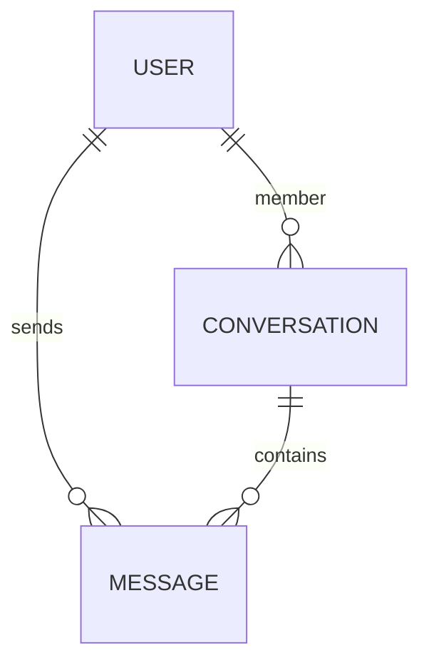

# Frontend System Design — Taghyeer Chat

Written **before** implementation. The app consumes a REST + Socket.io backend we do not control.

---

## 1. Clarify

### Who, on what, how often

| Question | Answer for this product |
|---|---|
| Who | Small-group chat users in the browser, not a million-user consumer app |
| Device | Desktop + phone. Chat is two-pane on desktop, one pane on mobile |
| Network | Unknown; API is on Render (cold starts). Design for slow first request, not fiber-only |
| Frequency | Session-based: login, pick a thread, send a few messages. Not a 24/7 presence product |
| Scale | Tens of conversations, hundreds of messages per thread — not 10k-row virtualization as a must |
| Greenfield | Yes. Next.js + React. We consume `https://frontend-task-chatapp.onrender.com` |

### The 5 questions

1. **User / device / network** — Browser, mid-range phones, Render latency. Landing page is public/SEO-ish; chat is behind login.
2. **Read vs write** — Inbox and history are read-heavy; send is write + realtime. Search is bursty (debounce).
3. **What changes often** — Messages and group metadata (rename, members) change often → sockets. Landing copy/layout is static.
4. **Failure mode** — Never a blank screen. Login/search/thread each have loading, empty, and error + retry. Socket drop: show disconnected, keep REST send working.
5. **100x data / 10x team** — Message list should be paginated (`limit` + `hasMore`) so a long thread does not dump the whole history. Folder-by-feature so a second person can own “groups” without touching auth.

### Functional vs non-functional

| Functional (must do) | Non-functional (how well) |
|---|---|
| Login with phone + name (auto-register) | First chat paint after login feels quick; don’t block on sockets |
| Search people, start 1:1 | Search debounced (~300ms); empty query never hits the API |
| Create group (3+ members) | Clear validation before request |
| Message list, mine vs theirs, timestamps | Stick-to-bottom unless user is reading history |
| Send message | Empty/whitespace **blocked in UI** (API accepts them) |
| Incoming messages without refresh | Socket `message:new`; sender uses REST response (no echo) |
| Loading / empty / error everywhere | Skeletons on list/thread; inline retry, not a full white screen |
| Landing page that explains the product | Distinct visual direction, responsive, LCP-friendly (SSG) |

### MoSCoW

**Must**

- Login / session restore (`/auth/me`)
- Search → 1:1
- Group create + group thread
- History, send, timestamps, sender distinction
- Socket receive + REST send
- Auto-scroll with “user scrolled up” guard
- Loading / empty / error
- Landing + chat deployed

**Should**

- Load older messages when scrolling up (`limit`, `hasMore`)
- Socket reconnect + connection indicator
- Group rename / add / leave (API exists; polish after core chat)
- Normalize REST `_id` vs socket `id` + ISO vs numeric `createdAt`

**Could** (after core is solid)

- “New messages” pill when not stuck to bottom (original, product-specific)
- Failed-send retry on a single bubble
- `conversation:updated` live header/inbox

**Won’t (MVP)**

- Offline-first sync, read receipts, typing indicators, file/image messages, push notifications, i18n, dark-mode-as-a-feature, virtualization of 10k messages, E2E suite, feature flags

---

## 2. Core entities & data model

Client types (normalized for the UI). Live API field names in comments.

```ts
type UserId = string;
type ConversationId = string;
type MessageId = string;

type User = {
  id: UserId;          // API: _id
  name: string;
  phone: string;
};

type Message = {
  id: MessageId;       // REST _id | socket id
  conversationId: ConversationId;
  senderId: UserId;
  text: string;
  createdAt: number;   // always ms epoch in the client
  status?: "sending" | "sent" | "failed"; // client-only
};

type DirectConversation = {
  id: ConversationId;
  type: "direct";
  participant: User;   // the other person
  lastMessage?: { text: string; senderId: UserId; createdAt: number };
  updatedAt: string;
};

type GroupConversation = {
  id: ConversationId;
  type: "group";
  name: string;
  createdBy: UserId;
  admins: UserId[];
  participants: User[];
  lastMessage?: { text: string; senderId: UserId; createdAt: number };
  updatedAt: string;
};

type Conversation = DirectConversation | GroupConversation;
```

**Relationships**



- Direct: `type: "direct"` — other person is `participant`
- Group: `type: "group"` — `participants[]`, `admins[]` (admins ⊂ members)

**Derive on the client (API does not give it)**

- `isMine` = `message.senderId === session.user.id`
- Thread title: direct → `participant.name`; group → `name`
- Empty-send: `text.trim().length === 0`
- Group create valid: `name.trim()` and `participantIds.length >= 2`

**Session**

```ts
type Session = { token: string; user: User };
```

Token in `localStorage`; memory copy in React context. Restore via `GET /auth/me`.

---

## 3. API / data layer contract

We **do not invent routes**. Adapter maps live paths → client types.

| Intent | Live call |
|---|---|
| Login | `POST /api/auth/login` `{ phone, name }` → `{ token, user }` |
| Me | `GET /api/auth/me` |
| Search | `GET /api/users/search?q=` → `User[]` |
| Inbox | `GET /api/conversations` → `{ data: Conversation[] }` |
| Start 1:1 | `POST /api/conversations` `{ userId }` |
| History | `GET /api/conversations/{id}/messages?limit&before` → `{ messages, hasMore }` |
| Send | `POST /api/messages` `{ conversationId, text }` |
| Create group | `POST /api/conversations/group` `{ name, participantIds }` |
| Socket | `io(origin, { auth: { token } })` |

**Pagination:** cursor-ish (`before` + `hasMore`). History is **newest-first**. Client reverses for display (oldest at top). `before` was unreliable in probes — trust `limit` + `hasMore`; treat `before` as best-effort.

**Realtime**

- Send: REST (source of truth for the sender). Optional socket `message:send` later; v1 stays REST + listen.
- Receive: `message:new` on **other** participants only.
- Groups: `conversation:updated` after rename/members — patch inbox + header.

**Error envelope**

```ts
type ApiError = {
  error: { message: string; code: string; details?: { path: string; message: string }[] };
};
```

Map: `NO_TOKEN` / `INVALID_TOKEN` → logout. `FORBIDDEN` / `NOT_FOUND` / `VALIDATION_ERROR` → inline. Missing token is **400**, not 401.

**Thin API module**

```
src/lib/api/client.ts     // fetch + Bearer + parse errors
src/lib/api/auth.ts
src/lib/api/users.ts
src/lib/api/conversations.ts
src/lib/api/messages.ts
src/lib/socket.ts         // singleton, token handshake
src/lib/mappers.ts        // _id → id, createdAt → number
```

---

## 4. Component architecture

Two products, one app: **marketing** (`/`) and **chat** (`/login`, `/app`).

```
src/
├── app/
│   ├── layout.tsx
│   ├── page.tsx                      # /  LandingPage
│   ├── login/
│   │   └── page.tsx                  # /login
│   └── app/
│       └── page.tsx                  # /app  ChatShell (client)
│
├── features/
│   ├── landing/
│   │   ├── Nav.tsx
│   │   ├── Hero.tsx                  # CTA → /login
│   │   ├── ProductPreview.tsx        # static mock, not live data
│   │   └── Footer.tsx
│   ├── auth/
│   │   └── LoginForm.tsx
│   ├── inbox/
│   │   ├── SearchPeople.tsx
│   │   ├── ConversationList.tsx
│   │   └── ConversationRow.tsx       # presentational, memo
│   ├── groups/
│   │   └── NewGroup.tsx              # dialog
│   └── thread/
│       ├── ThreadHeader.tsx
│       ├── MessageList.tsx
│       ├── MessageBubble.tsx         # presentational, memo, isMine
│       ├── JumpToLatest.tsx          # could-have
│       ├── Composer.tsx
│       └── ConnectionStatus.tsx
│
├── components/
│   └── ui/                           # shadcn: Button, Input, Dialog, Sheet, …
│
└── lib/
    ├── api/
    │   ├── client.ts
    │   ├── auth.ts
    │   ├── users.ts
    │   ├── conversations.ts
    │   └── messages.ts
    ├── socket.ts
    └── mappers.ts
```

`ChatShell` composes `Sidebar` (`SearchPeople`, `NewGroup`, `ConversationList`) and `Thread` (header, list, composer, connection status).

**Mobile:** `ChatShell` shows either sidebar or thread (`?c=` present). Back clears the param.

**Rules**

- Containers (pages / `ChatShell`) fetch and map.
- `MessageBubble`, `ConversationRow` are presentational + `React.memo`.
- Keep pages thin; logic lives under `features/`.

---

## 5. State management

| Kind | What | Where |
|---|---|---|
| Server | inbox, history, search, me | **TanStack Query** |
| Realtime | incoming messages, group patches | Socket → `queryClient.setQueryData` |
| Session | token + user | Auth context + `localStorage` |
| UI | composer text, group dialog, “stuck to bottom”, selected thread | `useState` / URL |
| URL | selected conversation | `?c=<conversationId>` |

**Query keys**

```
['session']
['conversations']
['messages', conversationId]
['users', 'search', q]
```

**Send mutation**

1. If `!text.trim()` return (never call API).
2. `POST /messages`.
3. Append mapped message to `['messages', id]`.
4. Patch inbox `lastMessage`.
5. On error, mark bubble `failed` with retry.

**Socket `message:new`**

- Ignore if `senderId === me` (we already appended from REST).
- Append if not duplicate (`id`).
- Update inbox `lastMessage`.
- If that thread is open and stuck-to-bottom → stay pinned; else increment “new” count.

**Do not** put the message list in Zustand/Redux. Query cache is the server-state store.

---

## 6. Rendering strategy

| Surface | Strategy | Why |
|---|---|---|
| Landing `/` | SSG (App Router server component + static) | Public, SEO, LCP, no auth |
| Login `/login` | CSR (client) | Form + token; no SEO need |
| Chat `/app` | CSR, `'use client'` | Sockets, Query, scroll — hydration of a live socket tree is the wrong fight |
| Auth gate | Client check token → `/auth/me`; else `/login` | Chat is private |

Landing does **not** mount Socket.io. Chat code-splits (`dynamic` import of `ChatShell`) so the marketing bundle stays small.

---

## 7. Performance pass

### Load

- Split: `ChatShell` not in the landing JS.
- Tailwind only; no heavy UI kit.
- Preconnect to `frontend-task-chatapp.onrender.com` on `/app` and `/login`.
- Images on landing: next/image, explicit sizes (CLS).

### Runtime

- Memo bubbles and rows.
- Debounce search 300ms; min 1 character.
- Message list: CSS column-reverse **or** explicit reverse + `overflow-anchor`; **do not** `scrollTop = scrollHeight` on every render.
- **Stick-to-bottom algorithm:** `isNearBottom` (threshold ~80px). New message + near bottom → scroll. User scrolled up → no forced scroll. Composer send → force scroll (user intent).
- Pagination: IntersectionObserver on the **top** sentinel when `hasMore`.
- Virtualize only if a thread is huge (Won’t for MVP; structure `MessageList` so it can wrap later).

### Perceived

- Sidebar + thread skeletons (not a centered spinner).
- Optimistic send is optional; REST is fast enough — prefer wait + disable composer vs fake bubbles if we cut scope.
- Socket badge: Connecting / Live / Offline.

### Budgets (targets, not CI-enforced)

- Landing JS modest; chat chunk allowed to be larger.
- LCP landing < 2.5s on a decent connection as a target, not a gate.

---

## 8. Cross-cutting

**a11y**

- Login: labelled inputs, `aria-invalid`, submit not only mouse.
- Thread: `aria-live="polite"` on the message region for incoming (don’t over-announce).
- Dialogs: focus trap for New Group.
- Contrast on bubbles (mine vs theirs) AA.

**Security**

- No `dangerouslySetInnerHTML` for message text (text nodes only).
- Token only in memory + `localStorage` (XSS risk accepted for MVP; httpOnly cookie is not available without a backend change).
- Don’t log JWTs.
- Client validation + still handle API errors.

**SEO**

- Landing: title, description, one `h1`. Chat: `noindex` if we add metadata.

**i18n**

- Won’t. English strings in one `copy.ts` so they aren’t scattered — cheap future hook.

**Errors / offline**

- Per-panel `ErrorState` + Retry.
- React `error.tsx` on `/app` so a bubble bug doesn’t kill landing.
- Socket disconnect ≠ logout; REST still works.

**Observability**

- Won’t ship Sentry in MVP. `console.error` in the API client is enough. Call out as v2.

---

## 9. Thread UX (highest polish)

The chat panel is the core product surface: list, send, realtime, auto-scroll.

**Open a thread:** fetch `limit=30`, reverse to oldest→newest, scroll to bottom, set `stuckToBottom = true`.

**Send:** if `text.trim()` is empty, do nothing. Otherwise `POST /messages`, append the REST response, scroll to bottom.

**Incoming (`message:new`):** ignore if you sent it (already on screen). Otherwise append. If `stuckToBottom`, scroll; if the user is reading older messages, do **not** pull them down — optionally bump a “new messages” count.

**Scroll:**

| User is… | New incoming message |
|---|---|
| Near the bottom (~80px) | Auto-scroll to latest |
| Scrolled up reading history | Stay put |
| Sending a message | Always scroll to latest (they meant to) |

Load older pages when the top of the list is visible and `hasMore` is true; prepend without jumping the scroll position.

---

## 10. How the pieces connect

Landing (`/`) is static. Login stores a JWT. `/app` is a client app: TanStack Query talks to REST; Socket.io only pushes `message:new` / `conversation:updated` into that same cache. The sender never waits on the socket — their bubble comes from the REST response.

---

## 11. Trade-offs (ADRs in short)

| Decision | Why | Cost |
|---|---|---|
| REST send + socket receive | Matches probes (no `message:new` on sender). One write path | Two transports to wire |
| TanStack Query | Loading/error/cache without Redux | Extra dependency |
| CSR chat, SSG landing | Sockets + SEO split | Chat TTI after JS |
| `localStorage` JWT | API is Bearer-only | XSS; document in README |
| shadcn/ui for app chrome | Accessible dialogs, forms, sheets without a heavy kit | Keep landing + bubbles custom |
| No Zod | Types + mappers already cover the API; form rules are a few `trim()` checks | No runtime schema on responses |
| Client empty-message guard | API stores `""` | Must not “trust the backend” |
| Skip group admin UI in v1 if time-tight | Chat panel ships first | Still **create** group + chat |

Zod would not remove the mappers. REST and UI shapes differ (`_id` vs `id`, ISO vs epoch, empty `lastMessage: {}`), so a schema would still need the same transforms, plus more code than `type User = { … }` and a `trim()` on login/search/send. TypeScript is the contract; the live API is stable enough that parsing every payload at runtime is extra upkeep, not safety.

**Deliberately not solved:** typing, receipts, offline queue, signed-cookie auth, `before` cursor correctness, newly-added member socket (not probed).

---

## 12. Implementation order (maps to this design)

1. Next.js scaffold, env, `api/client`, deploy  
2. Auth + route gate  
3. Inbox + search + start 1:1  
4. Thread: history, send, bubbles, timestamps  
5. Socket `message:new` + stick-to-bottom  
6. Group create  
7. States polish  
8. Landing  
9. README (setup, stack, trade-offs)

If time slips: cut admin settings and landing motion first. **Never cut** thread + socket + scroll.
